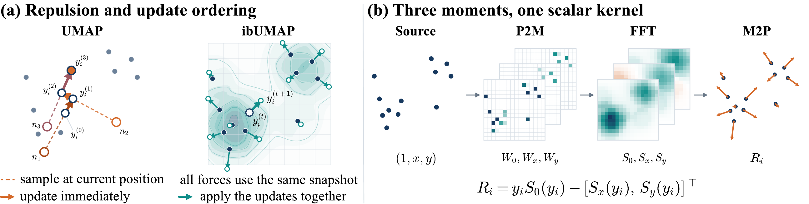

# ibUMAP: Coherent and Scalable Field Evaluation for UMAP Optimization

Reference implementation and reproduction package for the paper.

[](paper/ch1_figure_1.pdf)

**From sampled in-place updates to coherent field evaluation.** (a) From
shared initial coordinates, UMAP negative-sampling events update the head
immediately, whereas ibUMAP evaluates a radial repulsive field at one snapshot
and applies updates together. (b) Particle-to-mesh (P2M) deposition, FFT
convolution with a shared capped scalar kernel, and mesh-to-particle (M2P)
interpolation reconstruct the repulsion R<sub>i</sub> from three scalar moments.

## Abstract

UMAP achieves scalable layout optimization through stochastic negative sampling.
However, this stochasticity can lead to unstable embeddings across reruns and
downstream reuse, as the estimated repulsive forces depend on the ordering of
sampling events. We present ibUMAP, a coherent field-based alternative that
evaluates attraction and repulsion from a shared embedding snapshot and applies
them synchronously. Its degree-weighted repulsive field is motivated by the
conditional expectation of negative sampling for a fixed embedding and
represented by three scalar moments, which are evaluated efficiently on CPUs and
GPUs using an interpolation-based FFT scheme. This formulation avoids explicit
all-pairs computations while inducing optimization dynamics that differ from
those of standard online UMAP. Controlled experiments show that synchrony and
kernel capping alter the local–global fidelity trade-off, whereas FFT evaluation
produces small average changes in final quality. End-to-end benchmarks show
median speedups of 3.29× unseeded and 5.79× seeded over umap-learn on CPU, and
1.44× over cuML on million-scale datasets under unseeded GPU execution. These
gains accompany greater run-to-run stability and measurable fidelity trade-offs.

## Contents

| Part | Location | Purpose |
| --- | --- | --- |
| `ibumap` package | `src/ibumap/` | The estimator: CPU, CUDA and Apple Metal back ends, plus a umap-learn-compatible path, tFDP and evaluation metrics |
| Paper outputs | `paper/`, `scripts/paper/` | Rebuild every figure and table of the paper from frozen result summaries |
| Experiments | `experiments/` | The four experiments behind the paper, each with its protocol and commands |
| Datasets | `datasets/`, `scripts/datasets/` | Download and preparation scripts, metadata and checksums for the 71 benchmark datasets |
| Environments | `environments/` | Conda specifications and lock files of the paper environments |
| Tests | `tests/`, `scripts/common/tests/`, `experiments/*/tests/` | Unit tests and experiment protocol tests |

## Installation

Python 3.11 or newer. For the CPU path:

```bash
python -m pip install -e .
```

This builds a small C++20 extension for the CPU P2M kernel, so a C++ compiler
is needed (on macOS, the Xcode Command Line Tools). Optional extras:

| Extra | Adds |
| --- | --- |
| `.[cuda]` | CuPy and cuML (Linux) |
| `.[metal]` | MLX (Apple Silicon macOS) |
| `.[datasets]` | dependencies of the dataset scripts |
| `.[paper]` | dependencies of the figure and table builders |
| `.[test]` | pytest |

For GPU runs and for timings comparable to the paper, use the conda
environments in `environments/`:

| Environment | Platform | Used for |
| --- | --- | --- |
| `ibumap-cuda` | Linux x86-64, NVIDIA GPU | All paper experiments: ibUMAP CPU and CUDA, umap-learn, cuML, tFDP, the HDBSCAN case study |
| `ibumap-torchdr` | Linux x86-64, NVIDIA GPU | The TorchDR baseline only (does not install `ibumap`) |
| `ibumap-metal` | Apple Silicon macOS | ibUMAP on MLX/Metal (implemented and tested, not evaluated in the paper) |

```bash
# Linux, CUDA
conda env create -f environments/cuda-linux-64.yml
conda activate ibumap-cuda
IBUMAP_BUILD_CUML_GRAPH_EXT=1 python -m pip install --no-build-isolation --no-deps -e .
python scripts/smoke_test.py cuda

# macOS, Metal
conda env create -f environments/metal-osx-arm64.yml
conda activate ibumap-metal
python -m pip install --no-deps -e .
python scripts/smoke_test.py metal
```

[`environments/README.md`](environments/README.md) covers the exact package sets
from the lock files, the TorchDR environment, and troubleshooting.
`scripts/smoke_test.py` checks one execution path (`cpu`, `cuda`, `metal` or
`torchdr`) and exits non-zero if any check fails.

## Usage

```python
from ibumap import IBUMAP

embedding = IBUMAP().fit_transform(X)                  # ibUMAP on CPU
embedding = IBUMAP(device="cuda").fit_transform(X)     # or device="metal"
```

`X` is a dense array or a SciPy CSR matrix and is converted to `float32`. The estimator
defaults are 2 output dimensions, 15 neighbors, Euclidean distance and
`min_dist=0.2`. The paper uses `min_dist=0.1` and 200 epochs:

```python
model = IBUMAP(n_neighbors=15, min_dist=0.1, n_epochs=200)
```

**Repeatable runs.** A seed alone fixes the random draws but not the order of
parallel reductions. For runs that repeat bit for bit on the same device, set
both:

```python
model = IBUMAP(random_state=42, deterministic=True)
```

Deterministic mode selects order-stable reductions and deposition kernels; it
can cost some speed. Setting `random_state` without `deterministic=True`
triggers a `UserWarning`.

**Algorithms.** `algorithm="ibumap"` (default) is the method of the paper.
`algorithm="umap"` reproduces umap-learn's stochastic optimizer on CPU (bit
for bit in serial mode, given the same graph, initialization and random state) and runs cuML UMAP
on CUDA, behind the same interface. `"tfdp"` (a tFDP baseline) and `"hybrid"`
(an experimental schedule) are not the method of the paper.

**Fixed inputs.** To compare optimizers on the same graph and initialization,
prepare them once and optimize from them:

```python
model = IBUMAP(random_state=42, deterministic=True)
inputs = model.prepare_fixed_inputs(X)     # kNN, fuzzy graph, optimizer graph, spectral init
embedding = model.optimize_from_prepared_graph(inputs.optimizer_graph, inputs.init_embedding)
```

`fit_transform_from_knn` starts from precomputed nearest neighbors instead.

**Diagnostics.** `model.get_time_costs()` returns per-stage timings,
`model.get_init_diagnostics()` describes the initialization, and
`model.explain_effective_config()` reports the resolved configuration, including
parameters that were ignored for the chosen algorithm and device.

Quality metrics (trustworthiness, continuity, neighborhood preservation,
random-triplet accuracy, distance Spearman) are in `ibumap.evaluation`.

## Reproducing the paper

Reproduction has two levels.

### Level 1: figures and tables from the frozen results (CPU, minutes)

`paper/data/` holds the result summaries the paper was built from (about 4 MB,
with SHA-256 hashes in `MANIFEST.json`). Rebuilding needs no GPU, dataset or
compiled extension:

```bash
python -m pip install -e ".[paper]"
python scripts/paper/make_all.py        # paper/data -> paper/build, then verify
```

`make_all.py` ends with `scripts/paper/verify.py`, which checks every table and
plot-data file against the manuscript version, checks that every figure is
produced, and compares selected numbers quoted in the text.
[`paper/README.md`](paper/README.md) maps each figure and table label to its
builder and data files.

### Level 2: rerunning the experiments (GPU, days)

1. Create `ibumap-cuda` (and `ibumap-torchdr` for the TorchDR baseline) as
   described above.
2. Prepare the datasets (next section).
3. Run the experiments. Each README gives the protocol, commands, a small smoke
   configuration and the outputs:

   | Experiment | Paper | Content |
   | --- | --- | --- |
   | [`experiments/mechanism/`](experiments/mechanism/README.md) | Section 4 and appendix | Optimizer variants on fixed graphs and initializations, 59 datasets in three size suites; calendar audit |
   | [`experiments/psweep/`](experiments/psweep/README.md) | Appendix `tab:mechanism-psweep` | ibFFT interpolation order and stage schedule, 30 datasets, CPU and CUDA |
   | [`experiments/e2e_benchmark/`](experiments/e2e_benchmark/README.md) | Section 5 and Appendix B | End-to-end runtime, quality and run-to-run stability against umap-learn, cuML and TorchDR, 71 datasets |
   | [`experiments/braque/`](experiments/braque/README.md) | Section 6 and appendix | Rerun repeatability of a BRAQUE/HDBSCAN analysis and the cost of seeded runs |

4. Each experiment ends with an export step that writes its summaries in the
   `paper/data/` layout to `paper/rerun/`. Build the figures and tables from
   them with the Level 1 builders:

   ```bash
   python scripts/paper/make_all.py --data-dir paper/rerun --build-dir paper/build_rerun
   ```

   Verification against the manuscript is skipped for new results: timings
   and unseeded runs are not expected to reproduce bit for bit.

All paper results were produced on one Linux machine: an Intel Core i7-11700K
(8 cores, 16 threads), 32 GB RAM and an NVIDIA RTX A5000 (24 GB), with the
package versions of `environments/cuda-linux-64.conda.lock` and
`torchdr-linux-64.conda.lock`. Runtimes on other hardware will differ.

The mechanism experiment rebuilds its fixed inputs with
`spectral_scale_policy="legacy_box10_unoriented"`. With the paper's package
versions these are bit for bit the inputs of the paper (see
`experiments/mechanism/README.md`).

## Datasets

The 71 benchmark datasets come from nine families:

| Family | Datasets | Scripts |
| --- | ---: | --- |
| Tabula Sapiens v2 (CELLxGENE) | 35 | `scripts/datasets/tabula_sapiens_v2/` |
| C. elegans embryogenesis | 11 | `scripts/datasets/c_elegans_embryogenesis/` |
| Tabular ML benchmarks | 7 | `scripts/datasets/tabular_ml/` |
| scikit-learn classics (iris, wine, …) | 5 | `scripts/datasets/classic_benchmarks/` |
| scDEED | 4 | `scripts/datasets/scdeed/` |
| Whole mouse brain MERFISH | 4 | `scripts/datasets/whole_mouse_brain_merfish/` |
| MNIST, Fashion-MNIST, CIFAR-10 | 3 | `scripts/datasets/image_benchmarks/` |
| GIST-960 (ann-benchmarks) | 1 | `scripts/datasets/ann_benchmarks/` |
| Google News word vectors | 1 | `scripts/datasets/google_news/` |

Each family directory has `download.py` (where the data can be fetched
automatically), `prepare.py` and a README with the source and preprocessing.
Processed datasets are written to `datasets/processed/<id>/`. The repository
tracks only their `metadata.json` and `checksums.txt`, so a rebuilt dataset
can be checked against the one used in the paper:

```bash
python -m pip install -e ".[datasets]"
python scripts/datasets/classic_benchmarks/prepare.py iris
python scripts/datasets/validate_dataset.py datasets/processed/iris
```

`datasets/catalog.json` lists all datasets with their shapes and families
(`scripts/datasets/build_catalog.py` rebuilds it). See
[`scripts/datasets/README.md`](scripts/datasets/README.md).

## Tests

```bash
python -m pytest -q
```

This runs the unit tests of the package (`tests/`), of the shared experiment
helpers (`scripts/common/tests/`) and the protocol tests of the experiments.
Tests for unavailable back ends (CUDA, Metal, TorchDR) are skipped, so a passing
run does not show that a GPU was used; the smoke test does.

## Repository layout

```text
src/ibumap/
  api.py              IBUMAP estimator
  config.py           configuration dataclasses
  prepared.py         reusable fixed inputs (PreparedInputs)
  graph/              kNN and fuzzy graph construction (CPU, cuML)
  init/               spectral and custom initialization
  kernels/            ibFFT field evaluation and attraction kernels (CPU, CUDA, Metal)
  optimizers/         ibUMAP, UMAP and tFDP optimizers
  pipeline/           per-device orchestration
  evaluation/         embedding quality metrics
experiments/          mechanism, psweep, e2e_benchmark, braque
paper/                frozen data (data/), paper output map, Figure 1 (ch1_figure_1.pdf/.png)
scripts/paper/        figure and table builders, verification
scripts/common/       helpers shared by the experiments
scripts/datasets/     dataset download, preparation and validation
environments/         conda specifications and lock files
tests/                unit tests
```

## License

Not yet set. A license will be chosen after the provenance of third-party code
has been audited. `src/ibumap/init/_eigsh_cupy.py` is adapted from CuPy (MIT
license) and keeps its copyright notice.
